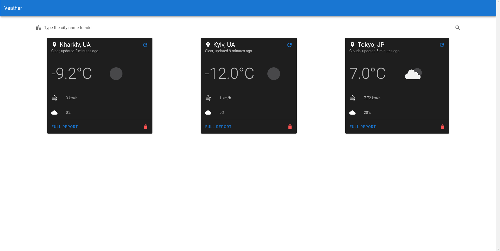

# veather

**Veather** stands for **V**ue + W**eather**

Simple weather app based on OpenWeatherMap API



## Table of Contents

- [Introduction](#introduction)
- [Features](#features)
- [Project structure](#project-structure)
- [Project setup](#project-setup)

## Introduction

Basic app for viewing weather fast. More of a practice project.

Project uses:
- [Vue.js](https://vuejs.org/) v2 ([Vue router](https://router.vuejs.org/), [Vuex](https://vuex.vuejs.org/))
- [Vuetify](https://vuetifyjs.com/en/)
- [date-fns](https://date-fns.org/)
- [ESLint](https://eslint.org/)
- [Prettier](https://prettier.io/)
- [StyleLint](https://stylelint.io/)
- [Sass](https://sass-lang.com/)
- [OpenWeatherMap API](https://openweathermap.org/api)
- [Axios](https://github.com/axios/axios)
- [TypeScript](https://www.typescriptlang.org/)

## Features

- Simple and clean interface
- Ability to save cities to localStorage
- Quick access to specific cities by URL
- Quick access to saved cities from home page

## Project structure

- src
  - [@types](src/@types) - Custom types for TypeScript
    - [store.d.ts](src/@types/store.d.ts) - Custom Vuex state types
    - [weatherData.d.ts](src/@types/store.d.ts) - OpenWeatherMap API responses types
  - [assets](src/assets)
  - [components](src/components) - Custom components
  - [modules](src/modules)
    - [axios.ts](src/modules/axios.ts) - Global Axios instance with predefined defaults
  - [plugins](src/plugins) - Vue CLI plugins
    - [vuetify.ts](src/plugins/vuetify.ts) - Vuetify config
  - [router](src/router) - Vue router config and routes
    - [index.ts](src/router/index.ts) - Router instance init
  - [store](src/store) - Vuex config
    - [weather](src/store/weather) - Vuex module for managing weather data
    - [index.ts](src/store/index.ts) - Vuex instance init
  - [views](src/views) - Vue pages
    - [FullReport.vue](src/views/FullReport.vue) - View of the weather full report page
    - [Home.vue](src/views/Home.vue) - Home page view. Contains saved cities data
  - [App.vue](src/App.vue) - Main Vue layout
  - [main.ts](src/main.ts) - Vue mount instance
  - shims-*.d.ts - Vue typescript shims

## Project setup

1. Clone the repo.

2. Create `.env.local` file at the root and add your OpenWeatherMap API key:

```
VUE_APP_API_KEY=
```

3. Install dependencies:

```
yarn install
```

### Compiles and hot-reloads for development
```
yarn serve
```

### Compiles and minifies for production
```
yarn build
```

### Lints and fixes files
```
yarn lint
```

### Customize configuration
See [Configuration Reference](https://cli.vuejs.org/config/).
